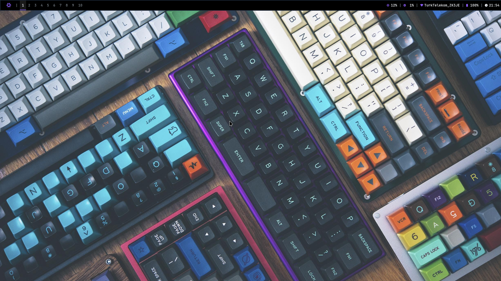

# Awesome + NixOS = nx

- **Looking:**  

- **Dependencies:**  
  * **AwesomeWM**: Window Manager  
  * **Rofi**: Application Launcher  
  * **Polybar**: Status Bar  
  * **Feh**: Wallpaper Setter  
  * **Neovim**: Text Editor
